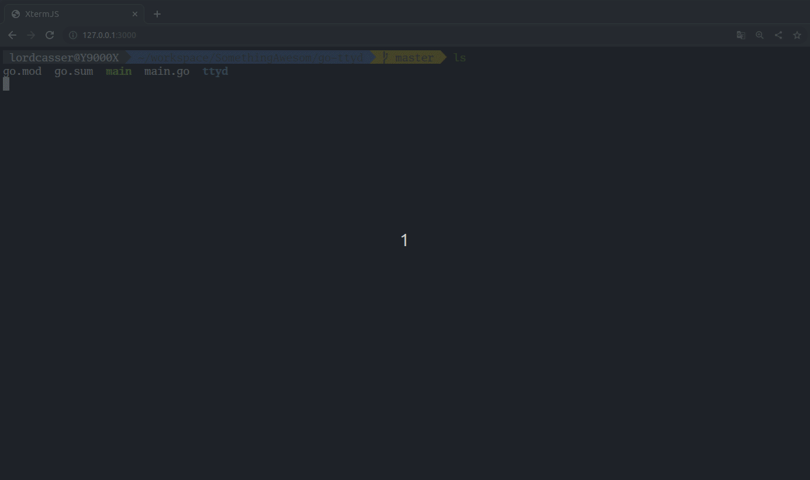

# GO-TTYD

Share your terminal over the web

## Demo

  

## Features

- Support Nerd fonts

## Usage

```
$ go-ttyd -p <port> <command [sh|bash|zsh|posh|...]>
```

## Alternatives

- [Wetty](https://github.com/krishnasrinivas/wetty): [Node](https://nodejs.org/) based web terminal (SSH/login)
- [GoTTY](https://github.com/yudai/gotty): [Go](https://golang.org/) based web terminal
- [ttyd](https://github.com/tsl0922/ttyd): C based web terminal
